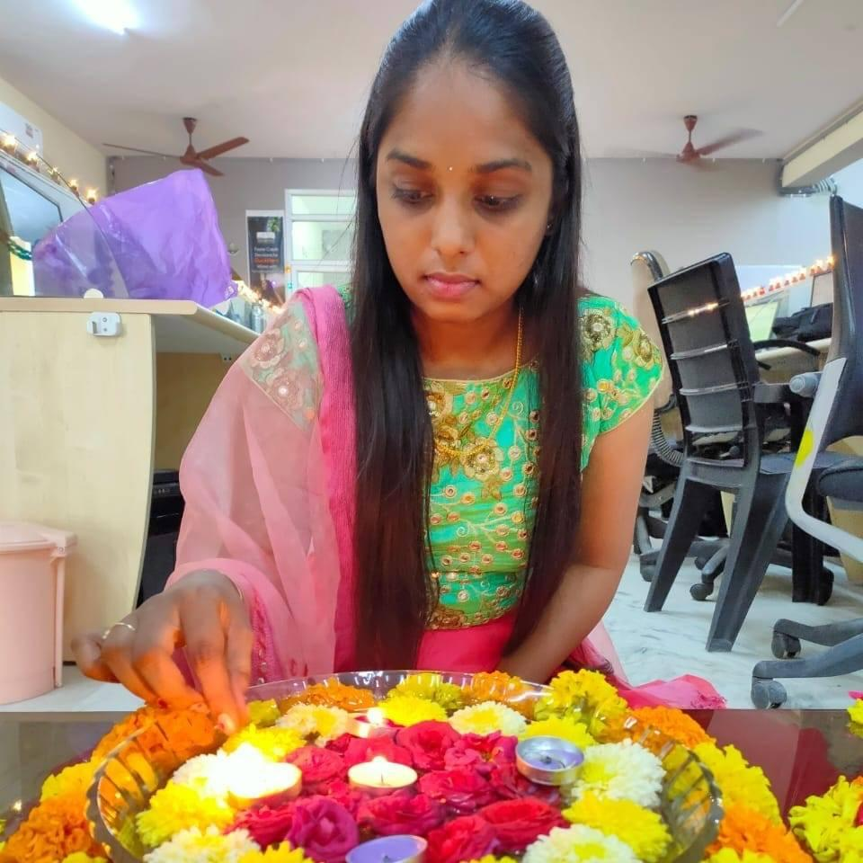

# Samyuktha Pandula

I have completed my undergradution from Civil Engineering. After my undergraduation, I started working as Software engineer for three yaers. I wanted to expand my knowledge in computer sciences so joined in Applied computer sciences program in North West Missouri State University.

----
# Cities and important Locations to visit

Table below describes the important cities in India and the historical places to visit in the cities and amount of time to be spent in each location to explore the place.
| City Name | Location in the city | Time to be spent |
| --- | --- | --- |
| Mumbai | Gate way of India | 2 hours |
| Agra | Taj Mahal | 5 hours |
| Amritsar | Golden temple | 1 hour |
| Mysuru | Mysore Palace | 2.5 hours |